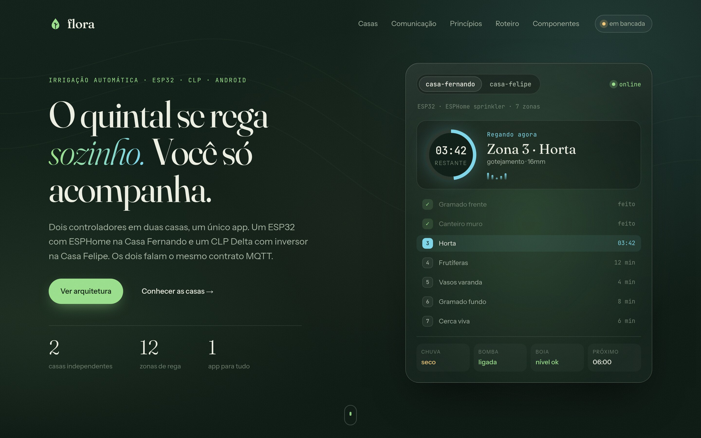
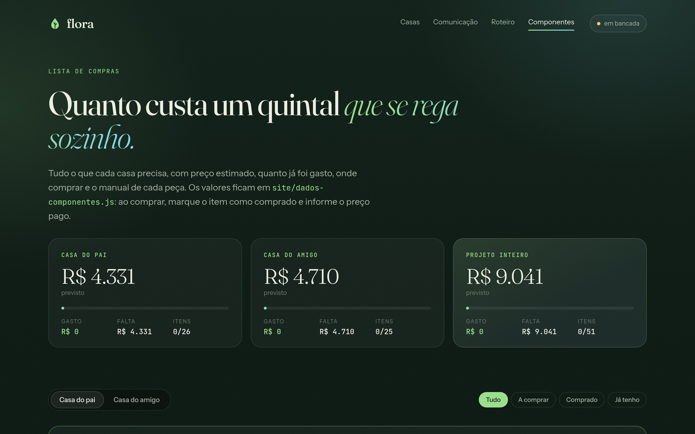

<div align="center">

# 🌱 lotus

**O quintal se rega sozinho. Você só acompanha.**

Irrigação automática para duas casas, com dois controladores físicos diferentes e um único app Android.



</div>

---

## O que é

O Lótus controla a irrigação de **duas casas independentes**. Cada casa tem seu próprio quadro,
sua própria bomba e sua própria conexão Wi-Fi. As duas são operadas pelo mesmo app, porque
falam o mesmo contrato MQTT (`lotus/v1`).

| | Site ESP | Site CLP |
|---|---|---|
| **Objetivo** | Custo baixo e conserto fácil | Reaproveitar equipamento parado |
| **Cérebro** | ESP32 + placa de 8 relés | CLP Delta DVP20SX211R + ESP32 como gateway |
| **Firmware** | ESPHome `sprinkler` | ESPHome `sprinkler` + `modbus_controller`, ladder no CLP |
| **Zonas** | 7 válvulas 24VAC | 5 válvulas 24VAC |
| **Bomba** | Contator 24VAC + boia em série | Inversor Metaltex IF10 com PID de pressão constante |

```
 ESP32 site ESP ───────┐
                      ├──►  Broker MQTT (nuvem, TLS)  ◄──  App Android (Kotlin)
 ESP32 site CLP ───────┘
```

Todos se conectam **de dentro para fora**: não é preciso abrir porta no roteador nem manter servidor em casa.
A agenda roda no quadro, então se a internet cair a irrigação continua.

## Estrutura

```
lotus/
├── docs/
│   ├── ARCHITECTURE.md      arquitetura física e de comunicação dos dois sites
│   ├── hardware/            notas de projeto por equipamento (o que usamos e como configurar)
│   ├── manuais/             PDFs originais dos fabricantes + extração em .txt
│   └── img/                 imagens do README
├── firmware/                ESPHome de cada quadro (lotus-esp.yaml)
├── broker/                  configuração do broker MQTT (nuvem e Mosquitto local)
├── tools/                   lotus_mqtt.py: ouve, comanda e simula um quadro
└── site/                    página de apresentação e lista de componentes (HTML, CSS e JS puros)
```

## Documentação

- [Arquitetura](docs/ARCHITECTURE.md): quadros, mapa de E/S, Modbus, contrato `lotus/v1` e roteiro
- [Contrato MQTT `lotus/v1`](docs/CONTRATO-MQTT.md): tópicos, comandos e erros
- [Broker](broker/README.md): EMQX na nuvem, permissões e broker local para testes
- [Inversor Metaltex IF10](docs/hardware/metaltex-if10.md): parametrização, PID e mapa Modbus
- [CLP Delta DVP20SX211R](docs/hardware/delta-dvp20sx2.md): especificações confirmadas e pendências
- [Índice de manuais](docs/manuais/README.md): o que já temos e o que falta

## Componentes e custos

A página [`site/componentes.html`](site/componentes.html) lista tudo o que cada casa precisa,
agrupado por etapa (bancada, quadro, bomba, sensores, hidráulica). Para cada item ela mostra o preço
estimado, quanto já foi gasto, o link de compra e o manual.



Os dados ficam em [`site/dados-componentes.js`](site/dados-componentes.js). Ao comprar um item,
mude `status` para `"comprado"`, preencha `pago` com o preço unitário e `loja` com o link.
Os totais se recalculam sozinhos.

## Página do projeto

A página fica em `site/` e não tem build nem dependências. Basta abrir no navegador:

```sh
xdg-open site/index.html
# ou servir localmente
python3 -m http.server -d site 8000
```

## Status

| Etapa | Situação |
|---|---|
| 1. Bancada do site ESP (ESP32 + relés + ESPHome) | 🟡 ESP32 gravado e testado com LEDs; falta a placa de relés |
| 2. Broker e contrato `lotus/v1` | ✅ ESP32 no EMQX, comandos e tópicos validados com `tools/lotus_mqtt.py` |
| 3. Instalação do site ESP | ⚪ |
| 4. Bancada do site CLP (IF10 + ladder + Modbus) | ⚪ |
| 5. Instalação do site CLP | ⚪ |
| 6. App Android (Kotlin) | ⚪ |
