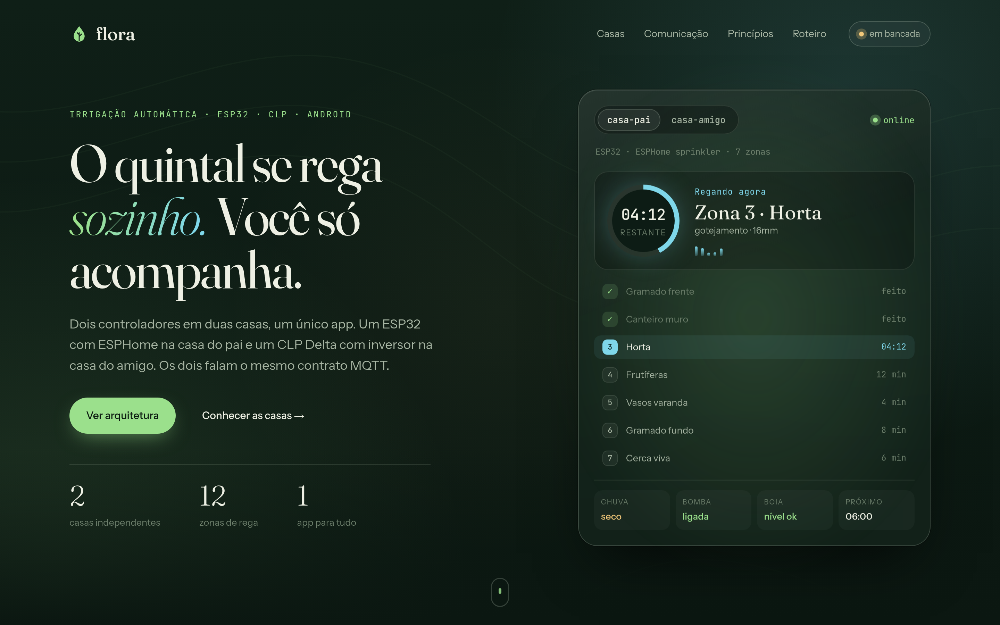

<div align="center">

# 🌱 flora

**O quintal se rega sozinho. Você só acompanha.**

Irrigação automática para duas casas, com dois controladores físicos diferentes e um único app Android.



</div>

---

## O que é

O Flora controla a irrigação de **duas casas independentes**. Cada casa tem seu próprio quadro,
sua própria bomba e sua própria conexão Wi-Fi. As duas são operadas pelo mesmo app, porque
falam o mesmo contrato MQTT (`flora/v1`).

| | Casa do pai (site A) | Casa do amigo (site B) |
|---|---|---|
| **Objetivo** | Custo baixo e conserto fácil | Reaproveitar equipamento parado |
| **Cérebro** | ESP32 + placa de 8 relés | CLP Delta DVP20SX211R + ESP32 como gateway |
| **Firmware** | ESPHome `sprinkler` | ESPHome `sprinkler` + `modbus_controller`, ladder no CLP |
| **Zonas** | 7 válvulas 24VAC | 5 válvulas 24VAC |
| **Bomba** | Contator 24VAC + boia em série | Inversor Metaltex IF10 com PID de pressão constante |

```
 ESP32 casa do pai ──┐
                     ├──►  Broker MQTT (nuvem, TLS)  ◄──  App Android (Kotlin)
 ESP32 casa do amigo ┘
```

Todos se conectam **de dentro para fora**: não é preciso abrir porta no roteador nem manter servidor em casa.
A agenda roda no quadro, então se a internet cair a irrigação continua.

## Estrutura

```
flora/
├── docs/
│   ├── ARCHITECTURE.md      arquitetura física e de comunicação dos dois sites
│   ├── hardware/            notas de projeto por equipamento (o que usamos e como configurar)
│   ├── manuais/             PDFs originais dos fabricantes + extração em .txt
│   └── img/                 imagens do README
└── site/                    página de apresentação (HTML, CSS e JS puros)
```

## Documentação

- [Arquitetura](docs/ARCHITECTURE.md): quadros, mapa de E/S, Modbus, contrato `flora/v1` e roteiro
- [Inversor Metaltex IF10](docs/hardware/metaltex-if10.md): parametrização, PID e mapa Modbus
- [Índice de manuais](docs/manuais/README.md): o que já temos e o que falta

## Página do projeto

A página fica em `site/` e não tem build nem dependências. Basta abrir no navegador:

```sh
xdg-open site/index.html
# ou servir localmente
python3 -m http.server -d site 8000
```

## Status

| Etapa | Situação |
|---|---|
| 1. Bancada da casa A (ESP32 + relés + ESPHome) | 🟡 próxima |
| 2. Broker e contrato `flora/v1` | ⚪ |
| 3. Instalação da casa A | ⚪ |
| 4. Bancada da casa B (IF10 + ladder + Modbus) | ⚪ |
| 5. Instalação da casa B | ⚪ |
| 6. App Android (Kotlin) | ⚪ |
